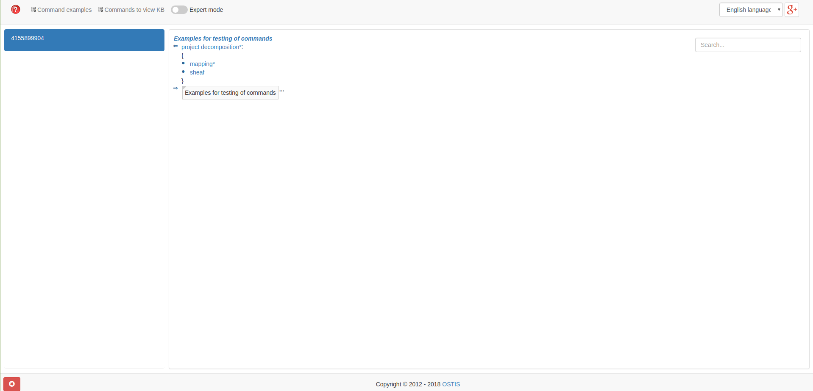

This instruction made for Ubuntu.

## Installation

Install all project:

```sh
git clone git@github.com:ostis-apps/idesa.git
cd idesa
git submodule update --init --recursive
cd scripts/
./install_deps_ubuntu.sh
./install_project.sh
```

Install Ubuntu dependencies:

```sh
./scripts/install_deps_ubuntu.sh
```

Update/Install submodules:

```sh
git submodule update --init --recursive
```

## Build
```sh
cd idesa/scripts
./build_kb.sh
```

## Run

### Run server 

There are 2 possible options to run:
#### Option 1. Run sc-server 

Run on Linux:
```sh
cd idesa/ostis-web-platform/scripts
./run_sc_server.sh
```

#### Option 2. Run sctp-server

The *sctp-server* is needed for *sc-web* interface processing. 

Run on Linux:
```sh
cd idesa/ostis-web-platform/scripts
./run_sctp.sh
```

## Run sc-web interface

```sh
cd idesa/ostis-web-platform/scripts
./run_scweb.sh
```

Then open localhost:8000 in your browser.

